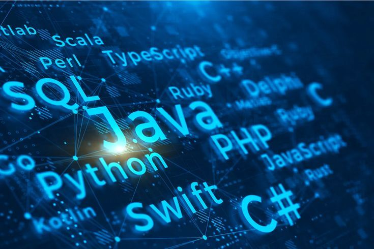

# Hi, I'm Ashely Gierisch

### Full-Stack Developer | 4+ Years of Experience

I’m a **Full-Stack Developer with 4+ years of experience**, specializing in **Python-based web development and modern application architecture**.

My main focus is building reliable and scalable **backend systems** with Python, Django, Flask, and FastAPI, while also working across the frontend, APIs, databases, and cloud infrastructure. I enjoy turning ideas into **practical, well-structured applications** that are built to grow.

  

---

## Technical Skills

### Languages

**Python · JavaScript · TypeScript · PHP · Java**

### Backend & API Development

**Django · Flask · FastAPI · Node.js · Spring Boot · Laravel**
RESTful APIs · API Integration · CI

### Frontend Development

**React · Next.js · Vue.js · Angular · React Native · Redux**
HTML5 · CSS3 · Responsive Web Development

### Cloud & DevOps

**AWS · Docker · Git · GitHub Actions · Jenkins**
EC2 · Lambda · S3 · CI/CD · Deployment & Automation

### Databases & Storage

**PostgreSQL · MySQL · MongoDB · Redis · SQL**

### Testing & Development Tools

**Jest · JUnit · Postman**

---

## What I Do

* Full-Stack Web Application Development
* Python Backend Development
* RESTful API Development
* Frontend Development with React & Next.js
* Database Design & Integration
* AWS Cloud Deployment
* Docker & CI/CD
* Automated Testing

---

## Let's Connect

  
  

---

  <i>**Building practical solutions with clean code and modern technologies.**</i>

